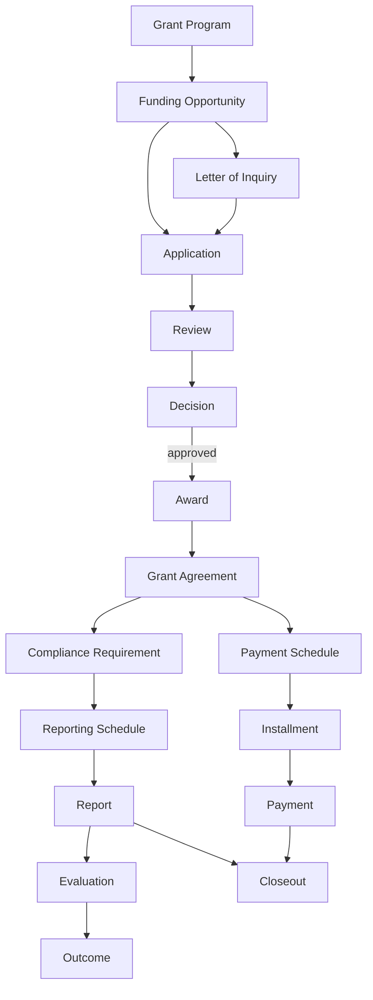
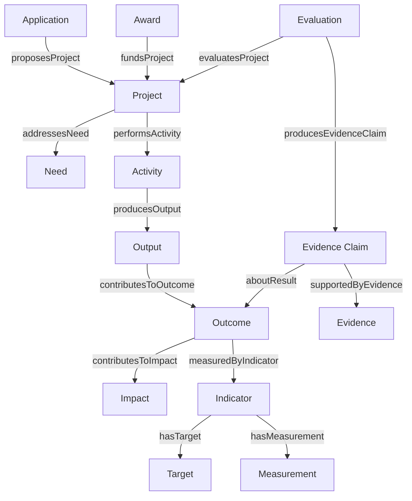

# Relationships

This describes how the concepts in [Core Concepts](02-core-concepts.md) connect, centered on the end-to-end grant lifecycle. Names in `code font` refer to concepts defined there.

## The grant lifecycle, end to end

1. A `Funder` maintains one or more `Grant Program`s, each of which issues `Funding Opportunity`s during defined `Funding Cycle`s.
2. A `Funding Opportunity` specifies `Eligibility Criteria`, and may require a `Letter of Inquiry` before a full `Application` is invited.
3. A `Grantee` (or a project operating under a `Fiscal Sponsor`) submits an `Application`, which includes a proposed `Budget`, in response to a `Funding Opportunity`.
4. The `Application` undergoes `Review` by one or more `Reviewer`s against published `Review Criteria`, optionally including a `Site Visit`.
5. Review produces a `Decision`. An approved `Decision` results in an `Award`.
6. The `Award` is formalized by a `Grant Agreement`, which specifies `Terms and Conditions` — including whether funding is `Restricted` or `Unrestricted`, and any `Matching Requirement`.
7. The `Award`'s funds are released according to a `Payment Schedule`, broken into `Installment`s. Each `Installment` may carry a `Payment Condition` that must be met before the corresponding `Payment` is made.
8. Over the life of the `Award`, the `Grantee` may request a `Budget Modification`, and either party may propose an `Amendment` to the `Grant Agreement`.
9. The `Grant Agreement` attaches `Compliance Requirement`s, including a `Reporting Schedule` that obligates the `Grantee` to submit `Report`s, and potentially an `Audit`.
10. Reports and other evidence are assessed against the project's `Logic Model` and/or `Theory of Change`, in terms of `Output`s and `Outcome`s, often through a formal `Evaluation`.
11. Once all `Payment`s are disbursed and all `Compliance Requirement`s (reports, audits) are satisfied, the `Award` reaches `Closeout`.

This sequence is the `Grant Lifecycle`.

## Key relationship rules (draft)

These are candidate business rules implied by the lifecycle above. They need review and are likely to have real-world exceptions — see [CONTRIBUTING.md](../CONTRIBUTING.md) to challenge or refine them.

- An `Award` cannot exist without a `Decision` that approved an `Application` (or, in funder-initiated giving, an equivalent internal approval).
- A `Payment` cannot exist without an `Award` and, typically, a `Grant Agreement` — though some funders disburse an initial installment before a fully signed agreement is in place.
- An `Installment`'s `Payment Condition`, if any, must be satisfied before its corresponding `Payment` is released.
- A `Compliance Requirement` is always attached to a specific `Award`, not to the `Grantee` in the abstract — the same organization can be in good standing on one award and delinquent on another. This is now explicit as its own relationship, `Compliance Requirement --appliesToAward--> Award`, distinct from `Grant Agreement --attachesComplianceRequirement--> Compliance Requirement`: the Agreement is the document that specifies the requirement, while `appliesToAward` tracks which Award it actually binds.
- `Closeout` requires both financial conditions (all `Payment`s made or the award formally reduced) and reporting conditions (all required `Report`s accepted) to be true.
- An `Amendment` changes the `Grant Agreement` going forward; it does not retroactively alter `Payment`s or `Report`s already completed under the prior terms.

## Organizational relationships

- `Funder`, `Grantee`, and `Fiscal Sponsor` are specializations of `Organization Role`, not of `Organization` directly — an `Organization` **plays** a role (`Organization --playsRole--> Organization Role`), and that occupancy **applies within** a specific `Philanthropic Arrangement` (`Organization Role --appliesWithin--> Philanthropic Arrangement`). This is what lets the same legal entity act as a `Funder` in one relationship and a `Grantee` in another (e.g., a community foundation re-granting government funds) without contradiction — see [Organizations, Roles & Arrangements](08-organizations-roles-and-arrangements.md) for the full reasoning.
- An `Organization` also has a `hasLegalForm` relationship to an `Organization Type` (e.g., Public Charity, Private Foundation) — its legal/tax classification, independent of any role it plays.
- A `Philanthropic Intermediary` is an organization classification (an `Organization` known for facilitating philanthropy on others' behalf), distinct from the `Funding Intermediary Role` it actually occupies in a given arrangement — a classification isn't a role, and an organization can be classified as an intermediary without every one of its engagements exercising that role.
- A `Fiscal Sponsor` stands in for a `Grantee` that lacks independent legal status to receive an `Award` directly; the `Grant Agreement` is between the `Funder` and the `Fiscal Sponsor` on behalf of the sponsored project.
- An `Award` names its parties directly and separately: who `awardedBy` (the original funding source), who it's `awardedTo` (the ultimate recipient), what `Fund` it's `fundedFrom`, and who's `managedBy` (day-to-day administration) — in a direct grant these collapse to the same two organizations as always; in intermediary philanthropy they can name three or four different ones.
- A `Grant Program` is `fundedBy` a `Fund` — the financial pool behind the program's giving strategy, distinct from the program itself.
- A `Program Officer` is associated with one or more `Grant Program`s and typically owns the `Review` and ongoing monitoring relationship for `Award`s made under them.
- A `Grant Administrator` is the `Grantee`-side counterpart, typically responsible for `Report` submission and `Compliance Requirement` tracking.
- `Fiscal Sponsorship Arrangement`, `Donor-Advised Fund Arrangement`, `Regranting Arrangement`, and `Collaborative Fund Arrangement` are `subClassOf Philanthropic Arrangement` — concrete named shapes of the base concept, not a separate `arrangementType` property (see [Organizations, Roles & Arrangements](08-organizations-roles-and-arrangements.md) for why). A `Fiscal Sponsorship Arrangement` `supports` a `Sponsored Project`, which is itself `fiscallySponsoredBy` an `Organization` — a project or group that carries out charitable activity without being an independent legal entity.
- `Donor-Advised Fund` is `subClassOf Fund`. A `Donor Advisor` `advises` a `Donor-Advised Fund` and `makesRecommendation`s (`Grant Recommendation`s) that `recommendsRecipient` an `Organization` and `concernsFund` the fund the money would come from. A `Grant Recommendation` the sponsoring organization accepts `leadsToAward` an `Award`, mirroring how `Decision --resultsInAward--> Award` works in the direct-grant path — the difference is that a recommendation is non-binding, while a `Decision` already represents the funder's own approval.
- A `Collaborative Fund Arrangement` `pools` a shared `Fund` across multiple funders; a `Regranting Arrangement` `regrantsTo` the downstream `Organization` receiving the redistributed funds.

## Programs, Results, and Evidence

An `Application` `proposesProject` and an `Award` `fundsProject` a `Project` — the work being performed, distinct from the request for funding and the funding commitment itself. An `Organization` `implementsProject`. A `Project` `addressesNeed`, `servesPopulation`, and `takesPlaceIn` a `Geographic Area`; the `Need` it addresses is itself `experiencedByPopulation`. A `Project` also `hasTheoryOfChange` and `hasLogicModel`, and the `Logic Model` in turn `includesInput`/`includesActivity`/`includesOutput`/`includesOutcome` — without the Logic Model ever being treated as equivalent to the Project itself.

The results chain: a `Project` `usesInput` and `performsActivity`; an `Activity` `producesOutput`; an `Output` `contributesToOutcome`; an `Outcome` `contributesToImpact`. Deliberately `contributesTo`, never `causes` — see Evidence Claim, below, for how a specific causal or contributory interpretation gets represented. `Output`, `Outcome`, and `Impact` are all `subClassOf Result`.

Measurement keeps a strict planned-vs-observed distinction: a `Result` (any Output, Outcome, or Impact) `measuredByIndicator` an `Indicator`, which `hasTarget` (the planned value, by a planned date) and separately `hasMeasurement` (the observed value, as of an observation date) — a `Target` and a `Measurement` are never treated as interchangeable. A `Measurement` is further `observedForPopulation` and `observedIn` a `Geographic Area`.

Evidence keeps causal claims out of the plain graph: an `Evaluation` `evaluatesProject` and `producesEvidenceClaim`. An `Evidence Claim` is `aboutResult` (again, any Output, Outcome, or Impact) and `supportedByEvidence` — never a bare `Project --caused--> Outcome` triple. A `Report` can itself `providesEvidence`. Every `Evidence Claim` carries a `claimType` (association, contribution, attribution, or causation — see [Properties & Rules](06-properties-and-rules.md#phase-37-milestone-3-reference-backed-properties-and-controlled-vocabularies)) and an `evidenceStrength`, so the ontology can distinguish a graph fact from an evaluator's assertion from the evidence backing that assertion.

Two class-hierarchy notes underpin this section: `Agent` is a new shared parent of `Person` and `Organization` (so a future relationship can target either without a duplicate predicate per entity type — the same reasoning `Result` follows for `Output`/`Outcome`/`Impact` above), and `agentPlaysRole` is now the preferred `Agent --plays--> Role` predicate, superseding the separate `playsRole` (Organization) and `personPlaysRole` (Person) predicates from the section above — both of which remain valid on existing data and are not migrated.

## Open questions

- Does `Evaluation` belong strictly after `Closeout`, or can it run concurrently with an active `Award` (e.g., mid-grant evaluation informing a renewal)?

Open an issue to discuss any of these before they're resolved in a future revision. (Re-granting — a `Grantee` that is itself a `Funder` to sub-grantees — used to be an open question here; it's resolved by the `Organization Role` pattern above: the same `Organization` simply holds two separate role occupancies, one per arrangement. Whether arrangement subtypes should be a `subClassOf` hierarchy or a shared `arrangementType` property was also an open question here; it's resolved above in favor of `subClassOf`, matching how `Funder`/`Grantee`/`Fiscal Sponsor` are modeled as subtypes of `Organization Role`. Whether `Decision` should be its own concept or folded into `Review` as an attribute was also an open question here; it's resolved by the Programs, Results & Evidence enhancement in favor of keeping it a separate concept, redefined as the recorded determination itself rather than its outcome — see [Core Concepts](02-core-concepts.md).)
