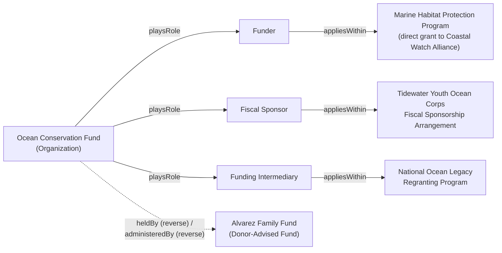

# Organizations, Roles & Arrangements

[Relationships](03-relationships.md) already says, in passing: "the same legal entity can act as a Funder in one relationship and a Grantee in another (e.g., a community foundation re-granting government funds)." That sentence has always been true in practice. Nothing before this document made it true *structurally* — `Funder`, `Grantee`, and `Fiscal Sponsor` were permanent subtypes of `Organization`, so an organization was either a Funder or it wasn't, full stop. This document makes the multi-role case a first-class part of the ontology, not just an aside in the prose.

The motivating case is an intermediary organization — a foundation that simultaneously runs its own grantmaking, sponsors other groups' projects fiscally, hosts donor-advised funds, and receives regranted funds from other funders. No single one of `Funder`/`Grantee`/`Fiscal Sponsor` describes such an organization; all of them might, depending on which engagement you're looking at.

## Is Funder an organization type or a contextual role?

A contextual role — and specifically, a **reified** one, not just a relabeled class.

Here's why reification (making the role-occupancy itself a thing you can point at, not just a type an organization has) is necessary rather than a nice-to-have. `Organization Role` needs its own attributes — when the role started, when it ended, whether it's still active. If "Org X is a Funder" were still expressed as a direct type on the Organization individual itself (`OrgX a npo:funder`), there would be exactly one place to hang `effectiveFrom`/`effectiveTo` for that organization's *entire* funding history — every award it has ever funded would have to share one pair of dates. That breaks the moment an organization funds one arrangement in 2019 and a different one in 2023, or is a Funder in one arrangement while simultaneously a Grantee in another. Reparenting `Funder` under a new "role" concept without reifying it would only relabel the same non-contextual claim; it wouldn't make it contextual.

So the pattern is:

```
Organization --playsRole--> Organization Role --appliesWithin--> Philanthropic Arrangement
```

Each `Organization Role` is its own individual: one specific organization, occupying one specific role, scoped to one specific arrangement, with its own `effectiveFrom`/`effectiveTo`/`status`. An intermediary organization has *multiple* `Organization Role` individuals pointing back to it via `playsRole` — one per engagement — not one global type.

`Funder`, `Grantee`, and `Fiscal Sponsor` are now subclasses of `Organization Role`, not `Organization`. Their concept ids, IRIs, and aliases are unchanged — only where they sit in the hierarchy and how their definitions are worded changed (they now read "the role an organization occupies when..." rather than "an organization that...").

## Can one organization hold multiple roles?

Yes, by construction. An organization has as many `playsRole` edges as it has real engagements, each landing on a distinct `Organization Role` individual. There's no upper bound and no requirement that the roles be different types — the same organization could hold two separate `Funder` occupancies for two unrelated grant programs, each with its own dates.

Contrast with the pre-refactor model, where this was structurally impossible to express without contradiction: an Organization individual was either typed `npo:funder` or it wasn't, and typing it as both `npo:funder` and `npo:grantee` simultaneously would have been legal RDF but meaningless — nothing distinguished "acts as funder in context A" from "acts as grantee in context B."

## Fund vs. Grant Program

A `Grant Program` describes a giving *strategy or area* — "Environmental Justice Grants," standing, named, thematic. A `Fund` is the financial resource pool that backs giving — a designated sum of money, with a currency, a restriction status, and open/close dates.

They're related but distinct: `Grant Program --fundedBy--> Fund` (a program draws on a fund), and separately `Award --fundedFrom--> Fund` (a specific award draws from a fund directly — useful when an award isn't tidily attached to one program, or when tracking exactly which pool of money paid for it matters more than which strategy it served).

## Intermediary vs. source of funds

Three different things, deliberately kept apart, because collapsing them is exactly the mistake that made intermediary organizations hard to represent:

1. **`Philanthropic Intermediary`** — a *classification*. What kind of organization this commonly is. A tag, roughly: "this organization is known for doing intermediary work."
2. **`Funding Intermediary Role`** — a *role occupancy*. What capacity this organization is acting in, for one specific arrangement. An organization classified as a Philanthropic Intermediary exercises that classification by holding a `Funding Intermediary Role` (via `playsRole`) within a given `Philanthropic Arrangement`.
3. **`Award`'s direct party edges** — a *fact about one award*: `awardedBy` (who originally committed the funds), `awardedTo` (who ultimately receives them), `fundedFrom` (which Fund paid for it), `managedBy` (who administers it day to day).

These three can name three different organizations on the same award. That's the entire point: a Funder awards money, an Intermediary channels it, and a Grantee receives it, and none of those has to be the organization managing the paperwork.

## How fiscal sponsorship and donor-advised funds fit (conceptually, for now)

At this level, both are instances of the base `Philanthropic Arrangement` concept — a structured relationship that channels funding outside a direct Funder → Award → Grantee path. An organization connects to an arrangement either loosely (`Organization --participatesIn--> Philanthropic Arrangement`, no role tracked) or precisely (an `Organization Role`, scoped via `appliesWithin`, when the specific capacity and its dates matter).

**Fiscal Sponsorship Arrangement**, **Donor-Advised Fund Arrangement**, **Regranting Arrangement**, and **Collaborative Fund Arrangement** are now built as `subClassOf philanthropic-arrangement` — see "Milestone 2: Intermediary philanthropy" below for how each attaches.

## Which party awards, funds, administers, and pays a grant

| Relationship | Answers |
|---|---|
| `award --awardedBy--> organization` | Who originally committed the funding |
| `award --awardedTo--> organization` | Who ultimately receives it |
| `award --fundedFrom--> fund` | Which pool of money paid for it |
| `award --managedBy--> organization` | Who administers it day to day |

In a direct grant, all the organization-valued answers are the same two parties (funder, grantee) as before — nothing about the simple case gets more complicated. In intermediary philanthropy, they can diverge: a foundation (`awardedBy`) grants through an intermediary (`managedBy`) to a sponsored group (`awardedTo`), funded from a specific donor-advised pool (`fundedFrom`).

## A consequence of reification worth knowing about: SHACL respects the subclass chain

Reparenting `Funder`/`Grantee`/`Fiscal Sponsor` under `Organization Role` doesn't just change where they sit in a diagram — it means every existing individual typed as one of them is now also, automatically, a SHACL-instance of `Organization Role`. `sh:targetClass` resolves subclass instances as part of the core SHACL specification, independent of whatever RDFS-inference mode a validator run uses for the rest of the data graph. Concretely: `Organization Role` requires a `status` value, so both existing worked-example individuals (`Ocean Conservation Fund`, typed `Funder`, and `Coastal Watch Alliance`, typed `Grantee`) needed a `status` added to satisfy it — SHACL validation caught this immediately when this milestone's ontology was first regenerated, and it was the correct thing to fix (these individuals *are* role occupancies now, so they legitimately need the attribute every role occupancy needs), not a check worth loosening.

The generator's own example-consistency check (`tools/generate_ontology.py`) was updated to walk the same `subClassOf` chain when resolving which properties apply to a concept, so it now flags a missing inherited required property (or an unknown property that's actually valid on an ancestor concept) the same way SHACL does, instead of only checking a concept's own directly-declared properties.

## Milestone 2: Intermediary philanthropy

The arrangement subtypes, Donor-Advised Fund, Sponsored Project, Grant Recommendation, and Donor Advisor are now built. Two open questions from Milestone 1 are resolved here, and two concepts from the original proposal were deliberately not added because they'd duplicate what's already modeled:

- **Donor Advisor is a person-level concept, not an `organization-role` subtype.** Milestone 1 left this open ("a person-role, if donor-advisors are more often individuals than organizations"). In practice a donor advisor is almost always the original individual donor (or their family member/designee), not an organization — so `Donor Advisor` sits alongside `Program Officer`, `Reviewer`, and `Grant Administrator` as a standalone person-level concept, with no `subClassOf` and no properties of its own, matching how those three are already modeled. `Fund --advisedBy-->` never got added under this name; the equivalent fact is `Donor Advisor --advises--> Donor-Advised Fund`, in the direction that matches this project's convention of the more specific/active concept being the relationship's subject.
- **"Sponsored Project Arrangement" was not added as a separate concept.** The original proposal listed it alongside Fiscal Sponsorship Arrangement, but on inspection they describe the same real-world relationship viewed from two sides — a fiscal sponsor administering funds for a sponsored project *is* the sponsored-project arrangement. Adding both would mean two concepts for one fact. `Fiscal Sponsorship Arrangement --supports--> Sponsored Project` covers it: the arrangement is the relationship, `Sponsored Project` is the party without independent legal status inside it.
- **"Funding Intermediary Arrangement" was not added as a separate concept**, for the same reason: it would overlap almost entirely with `Regranting Arrangement` (an organization receiving funds and redistributing them is exactly what a funding intermediary does). `Regranting Arrangement` covers both regranting proper and general intermediary fund-channeling; `Funding Intermediary Role` (Milestone 1) already covers the role an organization occupies while doing it.

What was built, and where it attaches:

- **`Fiscal Sponsorship Arrangement`**, **`Donor-Advised Fund Arrangement`**, **`Regranting Arrangement`**, **`Collaborative Fund Arrangement`** — each `subClassOf philanthropic-arrangement`, inheriting its `effectiveDate`/`terminationDate`/`status`/`governingDocument` properties.
- **`Donor-Advised Fund`** — `subClassOf fund`, inheriting its `restrictionType`/`currency`/`openingDate`/`closingDate`/`status` properties. Related to its arrangement via `Donor-Advised Fund Arrangement --governs--> Donor-Advised Fund`, and to its advisor via `Donor Advisor --advises--> Donor-Advised Fund`.
- **`Sponsored Project`** — a standalone concept (not `subClassOf organization`, deliberately: it lacks independent legal status, which is the entire point). Own properties: `startDate`, `endDate`, `status` (required). Related via `Fiscal Sponsorship Arrangement --supports--> Sponsored Project` and `Sponsored Project --fiscallySponsoredBy--> Organization`.
- **`Grant Recommendation`** — a standalone concept with `date` (required), `status` (required: pending/approved/declined), and an optional `amount`. `Donor Advisor --makesRecommendation--> Grant Recommendation --recommendsRecipient--> Organization`, `--concernsFund--> Fund`, and, once accepted, `--leadsToAward--> Award` — a distinct predicate from `Decision --resultsInAward--> Award` because a recommendation and a decision are not the same kind of approval (see the business rule below).
- **A new business rule**: a Grant Recommendation is non-binding — the sponsoring organization, not the Donor Advisor, retains legal authority over whether an Award actually results. This is a defining legal feature of donor-advised funds, not incidental detail.
- `Collaborative Fund Arrangement --pools--> Fund` and `Regranting Arrangement --regrantsTo--> Organization` round out each remaining subtype with one concrete edge, so every arrangement subtype has at least one relationship beyond what it inherits from the base `Philanthropic Arrangement`.

## Milestone 3: instance data and explorer views

Two things were missing after Milestone 2: the reification pattern and the whole organizational-foundation layer had zero instance-data coverage, and the explorer had no way to browse the ontology except as one undifferentiated graph. Both are addressed now, and a second gap was found and fixed along the way.

**A second thread in the worked example.** [ontology/source/example.json](../ontology/source/example.json) still tells one direct-grant story (Ocean Conservation Fund funds Coastal Watch Alliance), but now also follows a second, connected engagement: Ocean Conservation Fund turns out to be an `Organization` in its own right — not just a `Funder` — and, separately from that Funder occupancy, also plays a `Fiscal Sponsor` role for Tidewater Youth Ocean Corps (a `Sponsored Project`), funded by a different foundation (Pacific Coastal Trust) through a `Fiscal Sponsorship Arrangement`. This is the first real instance data for `Organization`, `Organization Role` occupancy (with dates), `Fund`, and `Philanthropic Arrangement`, and it's the first proof that one organization can hold two independently-dated roles — the exact case this whole phase exists to make representable. It also exercises the `Award` party edges from Milestone 1 (`awardedBy`/`awardedTo`/`managedBy`/`fundedFrom`) diverging across three different organizations for the first time. See [Worked Example](07-worked-example.md) for how the two threads share one file.

**A second inheritance gap, same shape as Milestone 1's.** Writing that second thread required relationships like `Organization --playsRole--> Funder` (an individual typed `funder`, not the generic `organization-role`) and `Fiscal Sponsorship Arrangement --administeredBy--> Organization` (a relationship declared on the ancestor `philanthropic-arrangement`, used by a subtype instance). Both failed the generator's own `validate_example` check, which compared an individual's concept to a relationship's declared subject/object *exactly* rather than allowing a subtype — the identical mistake Milestone 1 found and fixed for properties, just never applied to relationships. Fixed the same way: a new `ancestor_ids` helper walks the `subClassOf` chain, and `validate_example` now accepts a subtype wherever an ancestor concept is declared. The site had the same gap in `getOutgoingRelationships`/`getIncomingRelationships` (an arrangement subtype's concept page never showed relationships declared on `Philanthropic Arrangement`) — fixed with the same chain-walk, refactored into a shared `getAncestorChain` alongside `getPropertiesForConcept`.

That site fix turned out to satisfy most of what "per-type inspector tab variants" was asking for, without new tabs: `Fiscal Sponsor`'s Relationships tab now shows `applies within Philanthropic Arrangement` and `Organization plays Fiscal Sponsor` automatically, inherited from `Organization Role`, and `Organization`'s tab shows `plays Organization Role` the same way it always did. A bespoke "Roles" tab on `Organization` or "occupants" tab on `Organization Role` would just be re-displaying these same schema-level facts a second time. What a dedicated tab *would* add — which real organizations occupy a role, concretely — is exactly what the Example tab now shows: it was extended to hold more than one individual per concept (`getExamplesForConcept` returns an array, not a single individual), since `Organization` and `Award` each now have two instances across the two threads. Opening `Organization`'s Example tab shows both Ocean Conservation Fund and Pacific Coastal Trust; opening `Fiscal Sponsor`'s shows the specific occupancy. Per-type tabs were judged redundant with this rather than skipped for lack of time.

**Explorer views and shapes.** `/explore` gained a view selector (`site/src/data/explorer-views.ts`) — Full Ontology, Grant Lifecycle (everything except the 15 organizational-foundation concepts), Organizations & Roles, and Funds & Arrangements (each a curated concept allowlist, composable with the existing category checkboxes) — and node-shape differentiation by concept kind: `Organization` (and `Philanthropic Intermediary`) render as a rounded rectangle, `Organization Role` subtypes as a diamond, `Fund` subtypes as a hexagon, `Philanthropic Arrangement` subtypes as a tag, everything else as the original ellipse. Shape is a secondary encoding alongside the existing category color, with a legend in the sidebar — consistent with never relying on color alone.

## Milestone 4: the rest of the instance data, role-change diagrams, and legal-review flags

Three things were still schema-only after Milestone 3: the Donor-Advised Fund, Regranting, and Collaborative Fund paths had concepts and relationships but no worked-example individuals proving they actually work end to end. All three are built now, plus two things the reconciled product-plan review (Phase 3.6) asked for that hadn't come up yet: simple diagrams of an organization's role changes, and a way to flag concepts where this ontology's simplifications could mislead someone into skipping real legal review.

**Three more worked-example threads**, all still following [Ocean Conservation Fund](07-worked-example.md) except the last:

- **A Donor-Advised Fund.** Ocean Conservation Fund holds the Alvarez Family Fund; its donor, Elena Alvarez, is the `Donor Advisor`; her `Grant Recommendation` for Coral Reef Defenders is approved and `leadsToAward` a real `Award`, `fundedFrom` the DAF rather than Ocean Conservation Fund's general budget. First instance data for `Donor-Advised Fund`, `Donor Advisor`, `Donor-Advised Fund Arrangement`, and `Grant Recommendation`.
- **A Regranting Arrangement.** National Ocean Legacy Fund (a new organization) awards Ocean Conservation Fund $200,000 to regrant; Ocean Conservation Fund takes on a *fourth* independently-dated role — `Funding Intermediary` — and redistributes $35,000 of it to Kelp Forest Collective (another new organization) as a sub-grant, `awardedBy` Ocean Conservation Fund this time instead of `awardedTo` it. First instance data for `Funding Intermediary Role` and `Regranting Arrangement`.
- **A Collaborative Fund Arrangement.** This is the one thread that isn't about Ocean Conservation Fund: Pacific Coastal Trust (from Milestone 3's fiscal-sponsorship thread) and a new partner, Tidewater Community Foundation, pool contributions into the Coastal Resilience Fund and jointly fund a $20,000 award — to Kelp Forest Collective again, the same small grantee now shown drawing on two independent funding relationships. First instance data for `Collaborative Fund Arrangement`, and the first example of an `Award` with two `awardedBy` edges (both original funders named on the same award, which the ontology already allowed — this is just the first individual that exercises it).

Ocean Conservation Fund now has four `playsRole` occupancies across four separately-dated arrangements (Funder, Fiscal Sponsor, Funding Intermediary) plus a fourth capacity — hosting a Donor-Advised Fund — that isn't modeled as a role occupancy at all, on purpose (see below).

**Why hosting a DAF isn't a fourth `Organization Role`.** `Funder`, `Grantee`, `Fiscal Sponsor`, and `Funding Intermediary Role` all describe a capacity an organization exercises *toward another party in a transaction*. Holding a Donor-Advised Fund is different in kind: it's answered entirely by the direct `Fund --heldBy--> Organization` and `Donor-Advised Fund Arrangement --administeredBy--> Organization` edges already built in Milestones 1–2, and reifying it as another role would just duplicate what those edges already say without adding a date range anyone asked for. This is the same reasoning Milestone 1 used to reject an org-level "Grant Administrator" role — a direct edge is preferred over reification whenever nothing needs its own independent dated history.

**Role-change diagram.** The prose above and in Milestones 1–3 describes Ocean Conservation Fund's multiple roles; here's the structure as a picture:



Four boxes reachable from one `Organization` node, three of them real reified `Organization Role` occupancies each scoped to its own `Philanthropic Arrangement`, one a direct capacity with no role in between — exactly the distinction the paragraph above draws, now visible instead of only stated.

**Legal-review flags.** Eight concepts central to this phase carry real legal and tax-regulatory nuance that this ontology deliberately doesn't model in depth — fiscal sponsorship's comprehensive-vs-pre-approved-grant models have materially different liability consequences, for instance, and a donor-advised fund's "non-binding" recommendation is a federal tax-law requirement, not a design preference. Modeling that depth is out of scope (this project is a shared conceptual vocabulary, not a compliance engine), but silently saying nothing invites someone to treat the simplified model as sufficient on its own. So `concepts.json` gained one new optional field, `legalNote`, set on exactly the concepts where this applies: `Fiscal Sponsor`, `Sponsored Project`, `Fiscal Sponsorship Arrangement`, `Donor Advisor`, `Donor-Advised Fund`, `Donor-Advised Fund Arrangement`, `Grant Recommendation`, and `Regranting Arrangement`. It's not a general-purpose annotation field and it's not the concept-maturity status field Milestone 7 will add later (draft/stable/deprecated is about the ontology's own confidence in a definition; `legalNote` is about the underlying subject matter's real-world complexity) — it flows through to the generated RDF (`npo:legalNote`) the same as every other concept field, and renders as a callout on the concept's Overview tab and a small badge on its `/concepts` catalogue card.

## Phase 3.7 Milestone 2: contractor/vendor/service-provider/partner and the broadened role-context model

This project's own "Milestone 2" appears twice in this document under two unrelated numbering schemes — the section above (Phase 3.5's "Milestone 2: Intermediary philanthropy") and this one (Phase 3.7's own second milestone, built well after Phase 3.5 and 3.6 were done). They're unrelated; this section is explicitly labeled to avoid the ambiguity.

**Six new `Organization Role` subtypes**, filling in engagement shapes that don't fit `Funder`/`Grantee`/`Fiscal Sponsor`/`Funding Intermediary Role`: `Contractor`, `Vendor`, `Service Provider`, `Employer`, `Partner`, and `Sponsoring Organization`. The first four in particular are easy to blur together, so each is defined by what actually distinguishes it rather than left to a color or a shape in the explorer:

- **`Contractor`** — bound by a contract to deliver a specific, defined piece of work.
- **`Vendor`** — the source an organization purchases standard goods or services from, with no defined-work contract the way a Contractor has.
- **`Service Provider`** — an ongoing operational service, broader and less transactional than either a single Contractor engagement or a Vendor purchase.
- **`Partner`** — collaborates on shared work, in a relationship not adequately described as one party purchasing from or providing a service to the other.
- **`Employer`** — the organization-side counterpart to a person's `Employee` role (see Phase 3.7 Milestone 1).
- **`Sponsoring Organization`** — holds and administers a Fund on behalf of the fund's donor or benefactors, distinct from acting as a `Fiscal Sponsor` for a specific project (that distinction — fund-level vs. project-level administration — is the same one Milestone 4 above draws for why hosting a DAF isn't a role at all; here it *is* a role, because a Sponsoring Organization's relationship to the fund's donor is a real bilateral engagement with its own dates, unlike a plain `heldBy` edge).

The differences are load-bearing enough that documenting them here, not just in each concept's one-line definition, is the point: a reader comparing Contractor and Vendor side by side should come away knowing which one to use for a services engagement (Contractor, if there's a defined deliverable and contract) versus a supply relationship (Vendor).

**Broadened role-context, deliberately not the full union yet.** Until this milestone, only `Organization Role appliesWithin Philanthropic Arrangement` existed — fine for `Funder`/`Grantee`/`Fiscal Sponsor`, meaningless for a Contractor or Employer, which are scoped to an `Organization`, not an arrangement. The roadmap's original ambition was a single `Role appliesWithin Context` relationship spanning Organization/Award/Application/Agreement/Fund/Grant Program/Funding Opportunity/Philanthropic Arrangement/Project/Review/Payment/Decision. Two things ruled that out as a single relationship for now:

1. **The generator's global predicate-uniqueness constraint** (first hit in Milestone 1, for the same reason): `tools/generate_ontology.py` requires every relationship predicate to be globally unique across the whole ontology, because a predicate has exactly one declared subject/object concept pair. A true union-typed object (one predicate whose object can be *any* of twelve different concepts) isn't something the generator or its SHACL output represents today — modeling it properly would mean either a generator change to support declaring a predicate against a union of object concepts, or an OWL `owl:unionOf` construct. The latter was rejected outright: this codebase's main ontology graph has "no blank nodes" as a hard invariant for deterministic serialization (see `tools/generate_ontology.py`'s module docstring), and `owl:unionOf` is RDF-list-based, which is blank-node-based.
2. **No worked-example data yet needs the other ten context types.** Only two are actually exercised by real instance data so far: `Philanthropic Arrangement` (existing) and `Organization` (this milestone's Contractor example). Adding all twelve as distinct predicates speculatively, before anything uses them, is exactly the premature-abstraction this project avoids elsewhere.

So this milestone adds exactly one new relationship, **`Organization Role applies within Organization`** (predicate `organizationRoleAppliesWithinOrganization`, distinct from `organizationRoleAppliesWithin`/`personRoleAppliesWithin` for the same uniqueness reason as Milestone 1's `personPlaysRole`, sharing the same "applies within" display label) — enough for Contractor/Vendor/Service Provider/Employer/Partner to be usable now. The remaining context types (Award, Application, Agreement, Fund, Grant Program, Funding Opportunity, Project, Review, Payment, Decision) are deferred to whichever future milestone's worked examples first actually need one of them, at which point the generator-level question (one union-supporting predicate vs. continuing to mint per-context predicates) should be revisited rather than resolved speculatively here.

**`scope` becomes a governed-shape enum.** Phase 3.7 Milestone 1 added `role-scope` as a free-text `string` property (deferring its reference-data version to Milestone 3, per the original plan). This milestone converts it early to an inline `enum` — `organization-wide` / `program-specific` / `project-specific` / `award-specific` / `agreement-specific` / `arrangement-specific` / `transaction-specific` — because the broadened context model above makes "what is this role scoped to" a question worth answering consistently across every role, not just free text per instance. It stays a plain inline enum (not yet SKOS-backed reference data) until Milestone 3's reference-data framework lands, matching the same "inline now, governed later" path Milestone 1 took for `role-status`. The two existing worked-example individuals with free-text scope values (Tidewater Youth Ocean Corps's fiscal sponsorship and National Ocean Legacy's regranting program) were migrated to the closest matching enum value (`project-specific` and `arrangement-specific`, respectively), with their original descriptive text preserved in the `notes` property Milestone 1 added, rather than lost in the conversion.

**A sixth worked-example thread.** Tidal Marketing Collective, a communications firm, is engaged by Ocean Conservation Fund to produce its annual impact report — a `Contractor` occupancy scoped directly to the Organization (`organizationRoleAppliesWithinOrganization`), agreement-specific, rather than to any Philanthropic Arrangement. This is the first instance data for `Contractor` and for the new Organization-scoped context relationship, and the first worked-example role occupancy that isn't part of the philanthropic-arrangement family at all — proving the broadened context model actually works end to end, not just in schema. See [Worked Example](07-worked-example.md) and the "Contractor Relationship" tab in Story mode.

## What's still deferred

- **Org-level "Grant Administrator" role** — deliberately *not* added, unchanged from Milestone 1's reasoning: the existing `Grant Administrator` concept stays a person-level role, and award-level administration is covered by `award --managedBy--> organization`.
- **Enterprise-architecture layer** (Business Capability, Business Process, Application System, Data Object, Integration, Policy, Organizational Unit) — explicitly out of scope until the philanthropic structure above has had real use.
